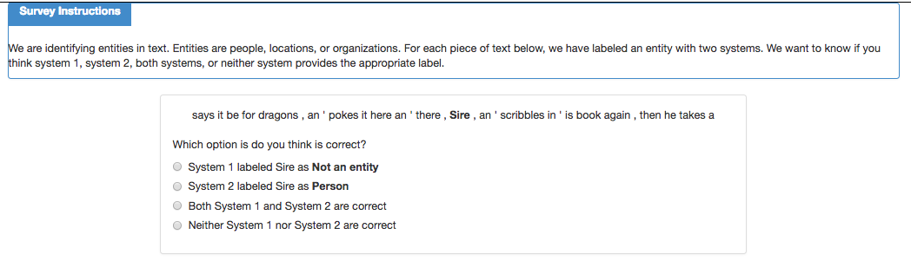
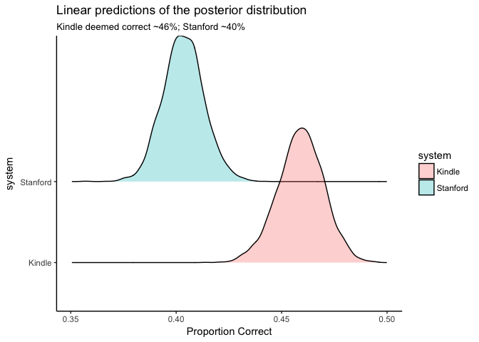
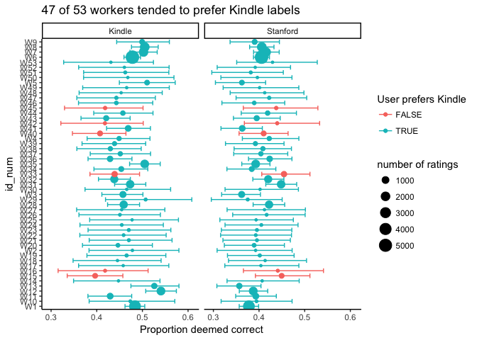
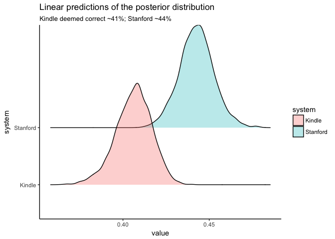
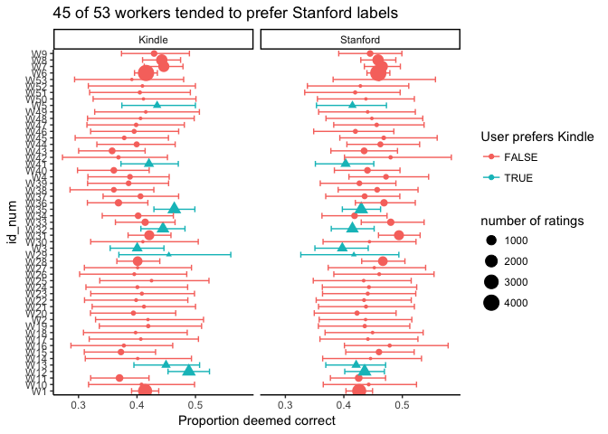

# Audible Mturk results


Recall that the mturk task asked workers to examine a segment of text that contained an entity label for which the kindle system and stanford's coreNLP disagreed. Workers were asked to identify whether a system 1, system 2, neither, or both provided the correct label, where system 1 and system 2 were counterbalanced to be kindle or stanford. Below is a screenshot of an example question:



Workers were give 5 text segments per hit. In total, there were 2719 disagreements, and each one was examined 5 times by mturk workers, yielding 5 human-provided preferences for each disagreement.

The first question I'll pursue here is how often workers indicated that they preferred each of the two systems. Because we have repeated measurements on the same unit and workers completed many tasks (the entire set of ratings comes from just 53 workers), we need to account for this non-independence. As such, I'll fit a hierarchical logistic regression of the form:

$$
y_{ij} = \beta X_{ij} + \gamma_iW_i + \sigma_{i}
$$
Where $\beta$ is a "fixed effect" coefficient vector with a term for the model intercept and the effect of system and is constant for all observations. The "random effects" represent deviations from this fixed effect. Specifically, $\gamma_i$ represents worker-specific deviations from the fixed effect. Essentially, this allows incorporating into the model the knowledge that there is heterogeneity in the response tendencies of individual workers. The final term in the model, $\sigma_{j}$ is the residual error term. The random effects contains deviations for the intercept and the effect of system.

The model was estimated using MCMC sampling as implemented in [Stan](mc-stan.org).


```r
library(dplyr)
library(tidyr)
library(stringr)
library(forcats)
library(ggplot2)
library(rstanarm)
library(ggjoy)

options(mc.cores = parallel::detectCores())
df1 <- rbind(read.csv('data/Batch_2881485_batch_results.csv'),
             read.csv('data/Batch_2881534_batch_results.csv'),
             read.csv('data/Batch_2881646_batch_results.csv'))
df1 %>%
  select(HITId, WorkerId, Input.index_a, Input.index_b, 
         Input.index_c, Input.index_d, Input.index_e) %>%
  gather(position, index, Input.index_a, Input.index_b, 
         Input.index_c, Input.index_d, Input.index_e) %>%
  mutate(position = str_sub(position, -1, -1)) -> questions

questions$system <- 'Kindle'
temp <- questions
temp$system <- 'Stanford'
questions <- rbind(questions, temp)

df1 %>%
  select(HITId, WorkerId, Input.aud_a, Input.stan_a, 
         Input.aud_b, Input.stan_b, Input.aud_c, Input.stan_c, 
         Input.aud_d, Input.stan_d,Input.aud_e, Input.stan_e) %>%
  gather(system, label, Input.aud_a:Input.stan_e) %>%
  mutate(position = str_sub(system, -1, -1),
         system = str_sub(system, 7, -3)) %>%
  mutate(system = factor(system, labels=c('Kindle', 'Stanford'))) -> sys_labels

df1 %>%
  select(HITId, WorkerId, Input.word_a, Input.word_b, 
         Input.word_c, Input.word_d, Input.word_e) %>%
  gather(position, word, Input.word_a:Input.word_e) %>%
  mutate(position = str_sub(position, -1, -1)) -> word

df1 %>%
  select(HITId, WorkerId, Answer.labela:Answer.labele) %>%
  gather(position, response, Answer.labela:Answer.labele) %>%
  mutate(value = 1) %>%
  spread(response, value, fill = 0) -> answer 

answer$aud[which(answer$both==1)] <- 1
answer$stan[which(answer$both==1)] <- 1

answer %>%
  mutate(position=str_sub(position, -1, -1)) %>%
  select(HITId, WorkerId, position, aud, stan) %>%
  gather(system, response, aud, stan) %>%
  mutate(system = factor(system, labels=c('Kindle', 'Stanford'))) -> answer

questions %>%
  left_join(answer) %>%
  left_join(sys_labels) %>%
  left_join(word) -> dat

# mod <- stan_glmer(response~system + (system|WorkerId),
#                   family='binomial', data = dat, prior=normal(0,5),
#                   prior_intercept = normal(0,5))
# 
# save(mod, file='output/mturk_mod1.rdata')
load('output/mturk_mod1.rdata')
```


```r
newdat <- data.frame(system=c('Kindle', 'Stanford'))
y_hat <- posterior_linpred(mod, newdata = newdat, re.form = NA , transform = T)
preds <- as.data.frame(y_hat)
names(preds) <- c('Kindle', 'Stanford')

preds %>% gather(system, value) %>%
  ggplot(aes(x=value, y = system, group=system, fill=system)) + 
  geom_joy(alpha = .3) +
  theme_classic() +
  ggtitle('Linear predictions of the posterior distribution',
          'Kindle deemed correct ~46%; Stanford ~40%') +
  xlab('Proportion Correct')
```

<!-- -->


```r
newdat_ref <- data.frame(expand.grid(system=c('Kindle', 'Stanford'), WorkerId = unique(dat$WorkerId)))
y_hat_ref <- posterior_linpred(mod, newdata = newdat_ref, re.form=~(system|WorkerId), transform = T)
ref_preds <- as.data.frame(y_hat_ref)
names(ref_preds) <- paste(newdat_ref$system, newdat_ref$WorkerId, sep='_')
dat %>% group_by(WorkerId) %>% summarise(number = n()) -> ratings

ref_preds %>%
  gather(system, value) %>%
  separate(system, c('system', 'WorkerId'), '_') %>%
  group_by(system, WorkerId) %>%
  left_join(ratings) %>%
  mutate(center=mean(value),
         lower = rstantools::posterior_interval(as.matrix(value), .95)[1],
         upper = rstantools::posterior_interval(as.matrix(value), .95)[2]) %>%
  select(system, WorkerId, center, lower, upper, number) %>%
  unique() %>%
  ungroup() -> plot.dat

temp <- data.frame(WorkerId = unique(plot.dat$WorkerId),
                   id_num = paste('W', seq_along(unique(plot.dat$WorkerId)), sep=''))
plot.dat %>%
  left_join(temp) %>%
  select(id_num, system, center, lower, upper, number) -> plot.dat

plot.dat %>% select(system, center, id_num) %>%
  spread(system, center) %>%
  mutate(kindle_pref = Kindle>Stanford) %>%
  right_join(plot.dat) -> plot.dat 

ggplot(plot.dat, aes(x=id_num, y=center, color=kindle_pref)) +
  geom_point(aes(size=number)) +
  geom_errorbar(aes(ymin=lower, ymax=upper)) +
  coord_flip() +
  facet_wrap(~system) +
  theme_classic() + 
  guides(shape=FALSE, size=guide_legend(title='number of ratings'), 
         color=guide_legend('User prefers Kindle')) +
  ylab('Proportion deemed correct') +
  ggtitle('47 of 53 workers tended to prefer Kindle labels')
```

<!-- -->

A second analysis asks about how frequently there is complete agreement. These would be labels that are unambiguously correct for one system. Disagreements that yielded this type of consensus from raters accounted for a little over half the total number of ratings. In these cases, the Kindle system was preferred 56% of the time (771 to 600)


```r
df1 %>%
  select(HITId, WorkerId, Answer.labela:Answer.labele) %>%
  gather(position, response, Answer.labela:Answer.labele) %>%
  mutate(value = 1) %>%
  spread(response, value, fill = 0) %>%
  mutate(position=str_sub(position, -1, -1)) -> answer 

dat %>%
  select(HITId, position, index) %>%
  distinct() %>%
  left_join(answer) -> dat2

dat2 %>% 
  group_by(index) %>%
  summarise(aud = sum(aud),
            stan = sum(stan)) %>%
  filter(aud==5|stan==5) -> complete_agreement

table(complete_agreement$aud>0)
```

```
## 
## FALSE  TRUE 
##   600   771
```


Finally, we noted that many of the most frequent disagreements were prefixes or titles. For instance, the table below shows the top 5 most frequently disagreed-upon words., of these, 3 are titles - Dr., Mrs. and Mr. If one system consistently includes these as parts of the name, and the other system does not, that may lead to biases in the estimates of the degree to which each system is doing a good job. As such, we removed the 23 most frequent prefixes and refit the same model that yielded the results above.


```r
knitr::kable(dat %>% group_by(word) %>% summarise(count = n()) %>% arrange(desc(count)) %>% head(., 5),
             format='latex')
```


\begin{tabular}{l|r}
\hline
word & count\\
\hline
Matisse & 738\\
\hline
Dr. & 560\\
\hline
Mrs. & 548\\
\hline
Mr. & 470\\
\hline
Tim & 470\\
\hline
\end{tabular}


```r
prefixes <- c('Dr.', 'Mrs.', 'Mr.', 'Inspector', 'Miss', 'Doctor', 'St.', 'King', 
              'Sergeant', 'Ms.', 'Officer', 'Chief', 'Madame', 'Dr', 'Mr', 'Mrs',
              'General', 'Lord', 'Master', 'the', 'The', 'Sailor', 'Superintendent'
              )

dat %>% filter(!word %in% prefixes) -> subdat

# mod2 <- stan_glmer(response~system + (system|WorkerId),
#                   family='binomial', data = subdat, prior=normal(0,5),
#                   prior_intercept = normal(0,5))
# save(mod2, file='output/mturk_mod2.rdata')
load('output/mturk_mod2.rdata')

y_hat <- posterior_linpred(mod2, newdata = newdat, re.form = NA , transform = T)
preds <- as.data.frame(y_hat)
names(preds) <- c('Kindle', 'Stanford')

preds %>% gather(system, value) %>%
  ggplot(aes(x=value, y=system, group=system, fill=system)) + 
  geom_joy(alpha = .3) + 
  theme_classic() +
  ggtitle('Linear predictions of the posterior distribution',
          'Kindle deemed correct ~41%; Stanford ~44%')
```

<!-- -->


```r
newdat_ref <- data.frame(expand.grid(system=c('Kindle', 'Stanford'), WorkerId = unique(dat$WorkerId)))
y_hat_ref <- posterior_linpred(mod2, newdata = newdat_ref, re.form=~(system|WorkerId), transform = T)
ref_preds <- as.data.frame(y_hat_ref)
names(ref_preds) <- paste(newdat_ref$system, newdat_ref$WorkerId, sep='_')
subdat %>% group_by(WorkerId) %>% summarise(number = n()) -> ratings

ref_preds %>%
  gather(system, value) %>%
  separate(system, c('system', 'WorkerId'), '_') %>%
  group_by(system, WorkerId) %>%
  left_join(ratings) %>%
  mutate(center=mean(value),
         lower = rstantools::posterior_interval(as.matrix(value), .95)[1],
         upper = rstantools::posterior_interval(as.matrix(value), .95)[2]) %>%
  select(system, WorkerId, center, lower, upper, number) %>%
  unique() %>%
  ungroup() -> plot.dat

temp <- data.frame(WorkerId = unique(plot.dat$WorkerId),
                   id_num = paste('W', seq_along(unique(plot.dat$WorkerId)), sep=''))
plot.dat %>%
  left_join(temp) %>%
  select(id_num, system, center, lower, upper, number) -> plot.dat

plot.dat %>% select(system, center, id_num) %>%
  spread(system, center) %>%
  mutate(kindle_pref = Kindle>Stanford) %>%
  right_join(plot.dat) -> plot.dat 

ggplot(plot.dat, aes(x=id_num, y=center, color=kindle_pref, shape=kindle_pref)) +
  geom_point(aes(size=number)) +
  geom_errorbar(aes(ymin=lower, ymax=upper)) +
  coord_flip() +
  facet_wrap(~system) +
  theme_classic() + 
  guides(shape=FALSE, size=guide_legend(title='number of ratings'), 
         color=guide_legend('User prefers Kindle')) +
  ylab('Proportion deemed correct') +
  ggtitle('45 of 53 workers tended to prefer Stanford labels')
```

<!-- -->
